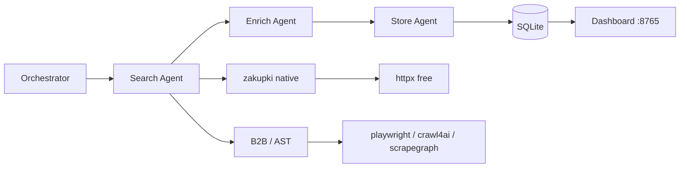

# Tender Lead Agents

Система агентов для сбора базы потенциальных клиентов из **открытых** площадок закупок: поиск тендеров по ключевым словам (например, «проведение онлайн опросов»), извлечение контактов, сохранение и экспорт в CRM.

**По умолчанию всё бесплатно** — без API-ключей, через `SCRAPER_BACKEND=httpx` и нативный парсер ЕИС.

## Площадки

| ID | Площадка | Режим |
|----|----------|--------|
| `zakupki` | [ЕИС](https://zakupki.gov.ru) | **Бесплатный** нативный парсер (httpx) |
| `b2b_center` | [B2B-Center](https://www.b2b-center.ru) | Playwright / Crawl4AI / ScrapeGraph |
| `sberbank_ast` | [Сбербанк-АСТ](https://www.sberbank-ast.ru) | Playwright / Crawl4AI / ScrapeGraph |
| `gosplan` | [ГосПлан API](https://wiki.gosplan.info) | JSON API (выкл. в конфиге) |

## Альтернативы ScrapeGraphAI (сравнение)

| Бэкенд | Стоимость | Когда использовать |
|--------|-----------|-------------------|
| **`httpx`** (default) | Бесплатно | **zakupki.gov.ru** — готовый парсер; прочие — базовый HTML |
| **Playwright** | Бесплатно | B2B-Center, Сбербанк-АСТ (нужен JS) |
| **Crawl4AI + Ollama** | Бесплатно | Сложная вёрстка, промпт на русском, данные не уходят в облако |
| **ScrapeGraphAI cloud** | Платно (~$17+/мес) | Минимум своего кода, stealth, MCP в Cursor |
| **Yandex AI Studio** | Yandex Cloud (тарифы) | Агенты Search/Enrich на YandexGPT, [aistudio.yandex.ru](https://aistudio.yandex.ru/ru/developers) |

Другие варианты (не встроены, но совместимы по идее):

- **scrapegraphai** (pip, MIT) — тот же вендор, локально + Ollama, без облака
- **ГосПлан API v2** — JSON вместо скрапинга ЕИС ([swagger](https://swagger.gosplan.info))
- **Официальный SOAP ЕИС** — нужен токен/ЭЦП с [zakupki.gov.ru/pmd](https://zakupki.gov.ru/pmd/auth/welcome)

```bash
tender-leads backends   # список бэкендов
```

## Быстрый старт (бесплатно)

```bash
cd agents
python3 -m venv .venv && source .venv/bin/activate
pip install -e ".[web]"

cp .env.example .env
# SCRAPER_BACKEND=httpx  — уже по умолчанию

# Только ваши ключи, без всего config/keywords.yaml
tender-leads run -s zakupki --keywords-only \
  -k "проведение онлайн опросов" -k "онлайн опрос" \
  --max-per-keyword 10

tender-leads list
tender-leads export -o data/leads.csv
tender-leads serve    # http://127.0.0.1:8765
```

## Открытые каналы (не тендеры)

Рейтинги и статьи с **таблицами «ФИО — должность — компания»** — отдельная воронка: лиды с `channel=open_media`, ссылка на материал, подсказки для поиска контакта (LinkedIn / Яндекс).

```bash
# Пример: «Топ-80 директоров по персоналу» (Коммерсантъ)
tender-leads open ingest --dry-run "https://www.kommersant.ru/doc/7180193"
tender-leads open ingest "https://www.kommersant.ru/doc/7180193"

# Закладки из config/channels.yaml (enabled: true)
tender-leads open bookmarks
```

В дашборде фильтр **«Канал»**: `tender` (закупки) / `open_media` (рейтинги и т.п.). Новые парсеры добавляйте в `src/tender_agents/channels/` и зарегистрируйте в `ingest.py`.

### B2B / Сбербанк (JS)

```bash
pip install -e ".[playwright]"
playwright install chromium
tender-leads run -s b2b_center -b playwright --keywords-only -k "опрос"
```

### Crawl4AI + Ollama (бесплатный LLM-скрапинг)

```bash
ollama pull llama3.2
pip install -e ".[crawl4ai]"
tender-leads run -s b2b_center -b crawl4ai -k "опрос"
```

### ScrapeGraphAI (платно)

```bash
# SGAI_API_KEY в .env
tender-leads run -b scrapegraph -s zakupki
```

### Yandex AI Studio (агенты)

Ключ и folder ID: [aistudio.yandex.ru → разработчикам](https://aistudio.yandex.ru/ru/developers).

```bash
pip install -e ".[yandex]"
cp .env.example .env   # YANDEX_API_KEY, YANDEX_FOLDER_ID

tender-leads yandex check

# Агенты Yandex: Search + Enrich + координатор (zakupki поиск всё ещё бесплатный)
tender-leads yandex run -s zakupki --keywords-only -k "онлайн опрос"

# или флаг к обычному run
tender-leads run --yandex-agent -s b2b_center -b yandex -k "опрос"
```

Инструкции агентов: `config/yandex_agents.yaml`.

## Архитектура



## Cron и OpenClaw

**Ежедневный сбор** — `scripts/daily-cron.sh`:

```bash
# crontab -e
0 8 * * * /Users/you/Desktop/agents/scripts/daily-cron.sh
```

macOS LaunchAgent: `scripts/com.openclaw.tender-leads.plist.example`

**OpenClaw** ([openclaw](https://github.com/openclaw/openclaw)) — не скрапер, а канал уведомлений. Skill: `skills/tender-leads/SKILL.md`. После cron ассистент может прислать: «Собрано N лидов, CSV в data/leads_YYYYMMDD.csv».

## Юридические ограничения

Только публичные данные, rate limit (`REQUEST_DELAY_SEC`), 152-ФЗ для персональных данных, соблюдение правил площадок.

## Структура

```
config/          keywords.yaml, sources.yaml
src/tender_agents/
  agents/        Search, Enrich, Store
  sources/       адаптеры площадок
  scrape/        бэкенды + parsers/zakupki.py
  web/           дашборд FastAPI
scripts/         cron, launchd
skills/          OpenClaw skill
```
