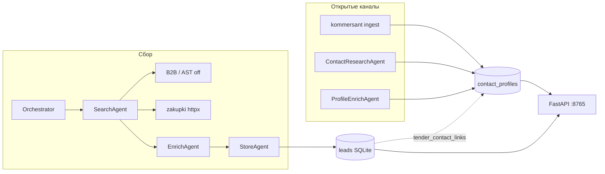
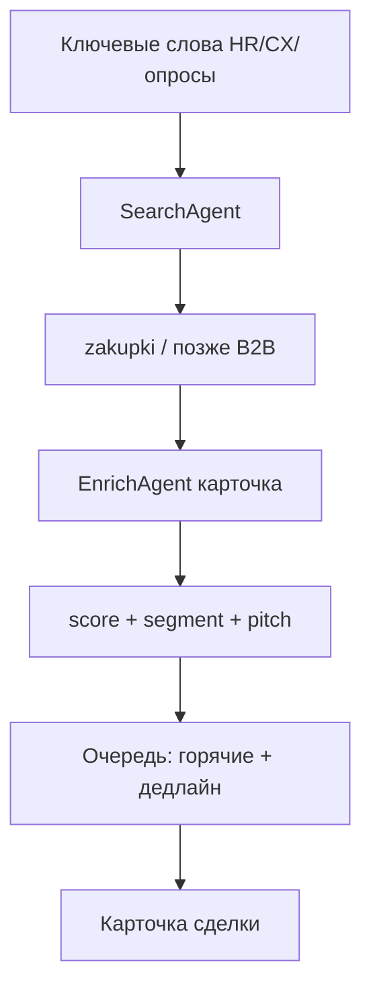
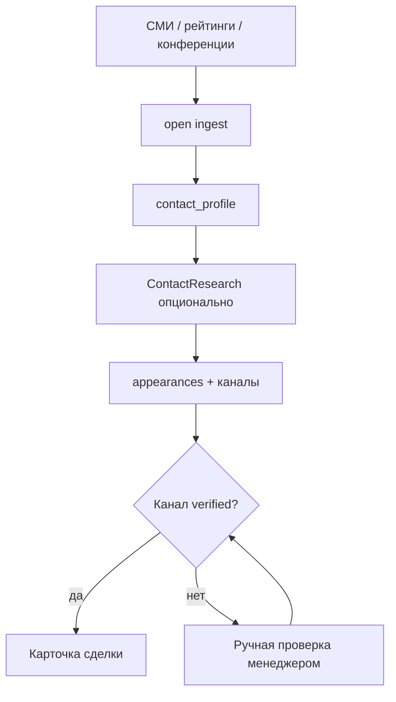
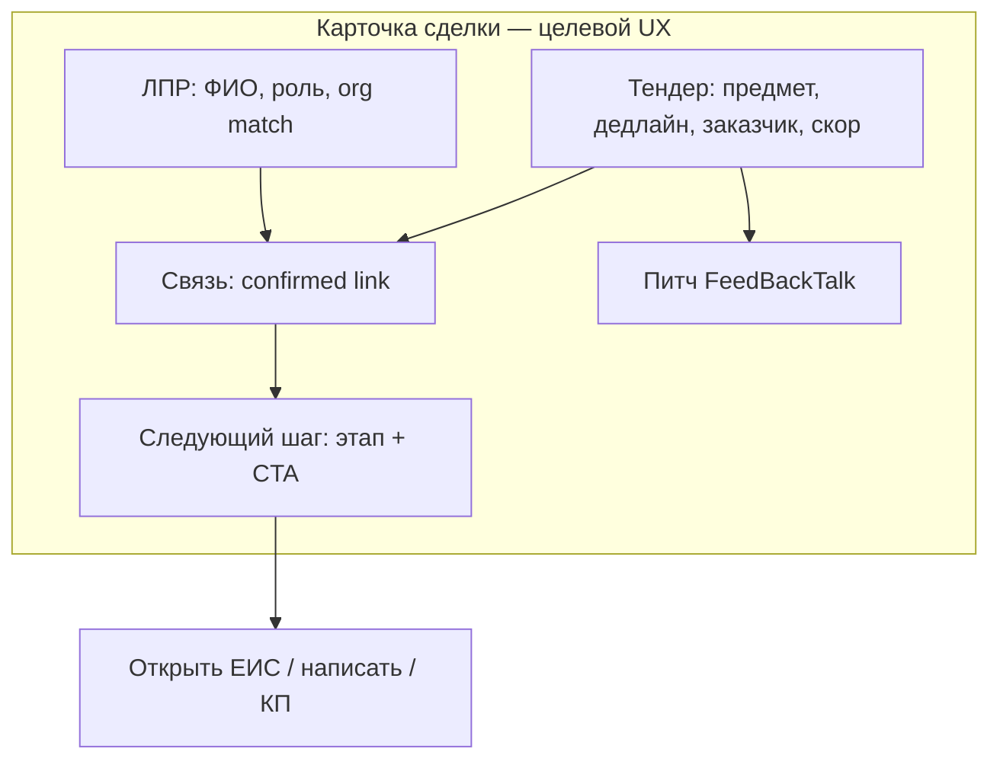
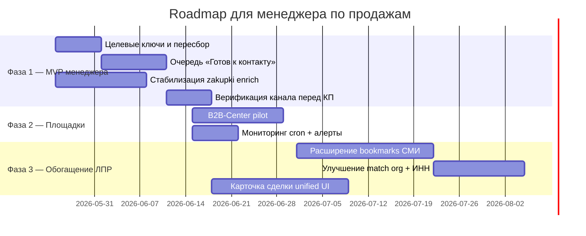

# Продуктовый пересмотр: инструмент для менеджеров по продажам FeedBackTalk

| Поле | Значение |
|------|----------|
| Продукт | FeedBackTalk — платформа CX / опросов / HR-пульс |
| Репозиторий | `tender-lead-agents` (Python, FastAPI, SQLite) |
| Версия документа | 1.1 · 2026-05-24 |
| Источник | `prompts/product-review-sales-managers.md` |

---

## Executive summary

Репозиторий **tender-lead-agents** уже реализует два потока для продаж FeedBackTalk: закупки с ЕИС (`zakupki`, канал `tender`) и ЛПР из открытых СМИ (импорт в `contact_profiles`, не в общую очередь тендеров). Пайплайн **Search → Enrich → Store** сохраняет тендеры со скорингом, сегментами `hr` / `cx` / `research` / `gov` и питчами; параллельно — Коммерсантъ-ingest, **ContactResearch** / **ProfileEnrich** и связи `tender_contact_links` (suggested → confirmed). **North Star** («за 15–30 минут — очередь действий: тендер + ЛПР + следующий шаг») пока не собран в один экран: нет preset **«готов к контакту»** и флага **channel_verified** перед КП. **P0**: целевые ключи и пересбор, стабильный enrich ЕИС, очередь горячих с CTA; **P1** — связь тендер↔ЛПР и единая карточка сделки; **P2** — B2B/AST, CRM, push после cron. Массовый холодный email из автопарсинга Google/DDG в v1 **не делаем**.

---

## Personas менеджера

| Persona | Цель | Как пользуется инструментом сегодня |
|---------|------|-------------------------------------|
| **Менеджер по тендерам** | Найти активную закупку на платформу опросов, успеть до дедлайна | `/` → фильтр «горячие ≥60», сортировка по срочности → карточка `/lead/{id}` → копировать питч → сменить этап воронки |
| **Менеджер по ЛПР** | Выход на HR/CX без тендера или в дополнение к нему | `Контакты` → импорт СМИ → карточка → «Исследовать в сети» / обогащение → связанные тендеры |
| **Руководитель продаж** | Видеть воронку и качество воронки лидов | `Воронка`, `Аналитика`, экспорт CSV |
| **Оператор / аналитик** | Настроить ключи, cron, площадки | `Настройки` → ключи, источники, запуск сбора, закладки `channels.yaml` |

**ICP (кому продаём через инструмент):** заказчик закупки (HR, CX, маркетинг, исследования, ИТ-закупка опросов); ЛПР из открытых источников (CHRO, HRD, директор по CX, руководитель исследований); сегменты в коде — `hr`, `cx`, `research`, `gov`.

---

## As-Is: что уже умеет продукт

### Архитектура (код)

### User journeys по экранам

| Экран | Маршрут | Что делает менеджер |
|-------|---------|---------------------|
| **Тендеры (очередь)** | `/` | Видит скор, сегмент, площадку, заказчика, дедлайн, этап воронки; фильтры: скор, сегмент, площадка, этап, канал `tender` / `all`, «горячие», «только текущие ключи», сортировка по срочности; ЛПР из СМИ — в «Контакты», не в этом списке |
| **Карточка тендера** | `/lead/{id}` | Питч FeedBackTalk (копировать), контакты с карточки ЕИС, **кандидаты ЛПР** из базы СМИ (подтвердить/отклонить связь), смена `pipeline_status` и заметок |
| **Контакты** | `/contacts` | Список ЛПР: организация, ФИО, должность, актуальность, e-mail/тел., ссылки поиска; пересчёт связей; пакетное обогащение (до 12) |
| **Карточка контакта** | `/contact/{id}` | Хронология появлений (СМИ + web), исследование в сети, sanitize каналов, связанные тендеры |
| **Воронка** | `/pipeline` | Kanban по этапам `new` → `qualified` → `proposal` → `demo` → `won` / `lost` (смена этапа — в карточке тендера) |
| **Аналитика** | `/analytics` | Сводка по скору, сегментам, этапам воронки (только канал `tender`) |
| **Настройки** | `/settings` | Ключи (`keywords.yaml`, опция `merge_extra` для HR/CX), источники, запуск сбора, Yandex API, импорт URL/закладок СМИ |

### CLI и автоматизация

- `tender-leads run` — пайплайн по включённым площадкам (`config/sources.yaml`: сейчас только `zakupki` enabled).
- `tender-leads open ingest` / `open bookmarks` — ЛПР из рейтингов.
- `scripts/daily-cron.sh` — ежедневный сбор; OpenClaw skill для уведомлений.

### Уже в данных и логике

- **Скоринг** (`scoring.py`): сегмент, горячность, срочность по `end_date`, штраф за нецелевой предмет закупки.
- **Питчи** (`pitches.py`) по сегменту + контекст СМИ для `open_media`.
- **Связь тендер↔контакт** (`contacts_db.rebuild_suggested_tender_contact_links`): fuzzy match организации заказчика и компании контакта, статусы `suggested` / `confirmed` / `rejected`.
- **ЕИС**: приоритет `common-info.html` над `printForm` при enrich (`scrape/parsers/zakupki.py`).

---

## Gap: ожидание менеджера → сейчас → приоритет

| Ожидание менеджера | Сейчас в продукте | P |
|--------------------|-------------------|---|
| Одна очередь «что делать сегодня» (тендер + человек + шаг) | Два раздела: Тендеры и Контакты; связь — в карточке тендера после ручного пересчёта | **P0** |
| «Готов к контакту» = горячий тендер + проверенный канал | Есть «горячие ≥60» и счётчик `with_contact`, нет флага «канал верифицирован» | **P0** |
| Стабильный zakupki, полные карточки | Нативный парсер + fallback URL; при 404 — snippet-заглушка | **P0** |
| Ключи только по продукту (опросы, HR, CX) | `keywords.yaml`: `crm`, `1С`; HR/CX в отдельных файлах, `merge_extra: false` | **P0** |
| Смена ключей → понятный пересбор | UI предупреждает: смена ключей не пересобирает БД автоматически; фильтр `current_keys` только отображает | **P0** |
| ЛПР: ФИО, должность, компания, где светился | `contact_profiles` + `appearances`, импорт Коммерсантъ | **P1** (есть) |
| Проверенный канал перед КП | `sanitize-channels`, ручной просмотр; нет workflow «verified» | **P0** |
| Связь закупки и ЛПР | Эвристика + confirm в UI; качество зависит от написания организации | **P1** |
| Питч под сегмент, копировать одним кликом | Есть в карточке тендера | — (OK) |
| B2B / коммерческие площадки | Адаптеры есть, в `sources.yaml` **выключены** | **P2** |
| Автоматический спам из Google/DDG | Не реализовано (сознательно); research — лимитированный | — (OK) |
| CRM sync | Только CSV export `/api/export` | **P2** |
| Единая «карточка сделки» | Тендер и контакт — разные страницы | **P1** |

---

## To-Be: два потока и карточка сделки

### Поток A — Тендеры

### Поток B — Люди / компании

### Схождение в «карточку сделки»

**Правило v1:** outreach только после `confirmed` связи **или** явного `channel_verified` на контакте; автоматическая рассылка по e-mail из парсинга — запрещена.

---

## Roadmap

| Фаза | Срок (ориентир) | Результат для менеджера |
|------|-----------------|-------------------------|
| **1. MVP для менеджера** | 2–4 недели | Утром открывает одну очередь; видит 5–15 дел с дедлайном, питчем и (после verify) контактом; zakupki не «пустые» |
| **2. Стабильные площадки** | +3–4 недели | zakupki + 1 коммерческая площадка; cron без сюрпризов; отчёт в Telegram/OpenClaw |
| **3. Обогащение ЛПР** | +4–6 недель | Больше рейтингов, точнее связь с тендером, единая карточка сделки |

---

## Backlog

| ID | Задача | P | Effort | Критерий готово (DoD) |
|----|--------|---|--------|------------------------|
| TLA-01 | Заменить `keywords.yaml` на набор по продукту (опросы, eNPS, VOC, платформа опросов); включить `merge_extra: true` или объединить HR/CX в основной список | P0 | S | В настройках отображаются ≥10 целевых ключей; тестовый `run` не находит «1С/CRM» |
| TLA-02 | Preset «Пересбор по текущим ключам» в UI: запуск с `--keywords-only` + опция очистки старых `matched_keyword` не из списка | P0 | M | Менеджер нажимает одну кнопку в «Запуск»; в очереди после сбора только релевантные совпадения |
| TLA-03 | Вкладка/фильтр **«Готов к контакту»**: `score≥60`, `status=active`, (`has_contact` OR `confirmed` tender-contact link), исключить `pipeline` won/lost | P0 | M | URL `/ready` или preset на `/`; ≤30 сек до первого действия |
| TLA-04 | Поле `channel_verified_at` + чекбокс в карточке контакта; блокировка копирования питча с e-mail, если не verified (мягкое предупреждение) | P0 | M | Менеджер отмечает «проверил тел/email»; в списке виден значок |
| TLA-05 | Доработка enrich zakupki: метрика % успешных карточек, авто-retry второго URL, badge «карточка неполная» в очереди | P0 | M | <10% лидов с текстом «Карточка ЕИС недоступна» за неделю cron |
| TLA-06 | На главной: блок «следующий шаг» (открыть ЕИС / перейти к ЛПР / сменить на proposal) по правилам этапа | P0 | S | В строке очереди одна primary CTA-ссылка |
| TLA-07 | Документировать и зафиксировать в UI лимиты `contact_research` (капча Яндекс → fallback, задержки) | P1 | S | Подсказка в карточке контакта совпадает с фактическим поведением агента |
| TLA-08 | Улучшить `rebuild_suggested_tender_contact_links`: нормализация юр. форм (ООО/ПАО), опционально ИНН заказчика | P1 | L | На тестовой выборке ≥30% suggested подтверждаются менеджером без правки |
| TLA-09 | В карточке тендера: сводный блок «Рекомендуемый ЛПР» (лучший confirmed, иначе top suggested) | P1 | M | Не нужно открывать `/contacts` для типового сценария |
| TLA-10 | Pilot B2B-Center: `enabled: true`, Playwright в cron, 3–5 ключей | P2 | L | ≥5 качественных лидов/неделю с площадки |
| TLA-11 | Расширить `config/channels.yaml`: 3–5 закладок HR/CX рейтингов + cron `open bookmarks` | P2 | M | База контактов +50 профилей/месяц без ручного URL |
| TLA-12 | Webhook/уведомление после cron (OpenClaw skill): N новых горячих, топ-3 с дедлайном | P2 | M | Менеджер получает сообщение без входа в дашборд |
| TLA-13 | Unified «карточка сделки»: один URL с табами Тендер / ЛПР / История | P1 | L | Переход с очереди не требует 2–3 кликов между разделами |
| TLA-14 | Экспорт CRM: поля deal_id, segment, pitch, contact_verified, tender_url | P2 | M | CSV импортируется в Bitrix/amo без ручной склейки |
| TLA-15 | Аналитика: воронка с конверсией hot→proposal→won по сегменту | P2 | S | На `/analytics` видны % по `hr/cx/research` |

---

## Риски

| Категория | Риск | Митигация в плане |
|-----------|------|-------------------|
| **152-ФЗ / ПДн** | E-mail, телефон, ФИО из открытых и полуоткрытых источников | Только публичные данные; заметки в README; не массовая рассылка; хранение локально SQLite; политика удаления по запросу — вне v1, но не автоспам |
| **Правила площадок** | Блокировка IP при частом скрапинге ЕИС/B2B | `REQUEST_DELAY_SEC`, cron 1×/день, httpx для zakupki |
| **Техн.: ЕИС printForm 404** | Пустые карточки, неверный скор | Уже: fallback URL; TLA-05 — метрики и badge |
| **Техн.: капча Яндекс/DDG** | Contact research возвращает пусто | CAPTCHA_MARKERS в агенте; ручной поиск; не ставить research в cron |
| **Качество данных** | «Коммерсантъ» org ≠ «заказчик» в ЕИС | Confirm/reject links; TLA-08 |
| **Конфиг** | Случайный запуск с чужими ключами | TLA-01, preset в UI, `current_keys` filter |
| **Yandex API** | 404 Responses API | Документировано в `docs/yandex-setup.md`; chat completions по умолчанию |

---

## Что НЕ делать в v1

- Массовый холодный email / LinkedIn-автоматизация из выдачи поисковиков.
- Парсинг закрытых баз (контакты с платных агрегаторов, слитые базы).
- Переписывание стека (остаёмся: Python, FastAPI, SQLite, существующие агенты).
- Включение всех площадок сразу (B2B + AST + Gosplan + Yandex) без стабильного zakupki.
- Автоматическая отправка КП без `channel_verified` или `confirmed` связи.
- Хранение секретов в документации или коммите `.env`.

---

## Что нажимать завтра (кратко для менеджера)

1. **Настройки → Ключи** — привести список к опросам/HR/CX (см. TLA-01); при необходимости включить merge HR/CX.
2. **Настройки → Запуск → Сбор** — `zakupki`, `--keywords-only` с актуальными ключами.
3. **Тендеры** — фильтр «горячие ≥60», сортировка **«По срочности»**; открыть карточку → **Копировать питч**.
4. **Импорт СМИ** — прогнать закладку Коммерсантъ (или добавить URL); **Контакты → Пересчитать связи**; в тендере **Подтвердить** нужного ЛПР.
5. Перед письмом — в карточке контакта проверить e-mail/тел. (**Убрать мусор**), при необходимости **Исследовать в сети** (не чаще разумного лимита).

---

## Привязка к коду (справочник)

| Возможность | Модуль |
|-------------|--------|
| Пайплайн тендеров | `agents/orchestrator.py`, `search_agent.py`, `enrich_agent.py`, `store_agent.py` |
| ЕИС | `sources/zakupki.py`, `scrape/parsers/zakupki.py` |
| Скоринг / сегменты | `scoring.py`, `models.LeadSegment` |
| Питчи | `pitches.py` |
| ЛПР и связи | `contacts_db.py`, `channels/kommersant.py`, `agents/contact_research_agent.py` |
| Дашборд | `web/app.py`, `web/html_pages.py` |
| Ключи / источники | `config_loader.py`, `config/keywords*.yaml`, `config/sources.yaml`, `config/channels.yaml` |

---

*Документ подготовлен по состоянию репозитория на 2026-05-24. Код в этом проходе не менялся.*
