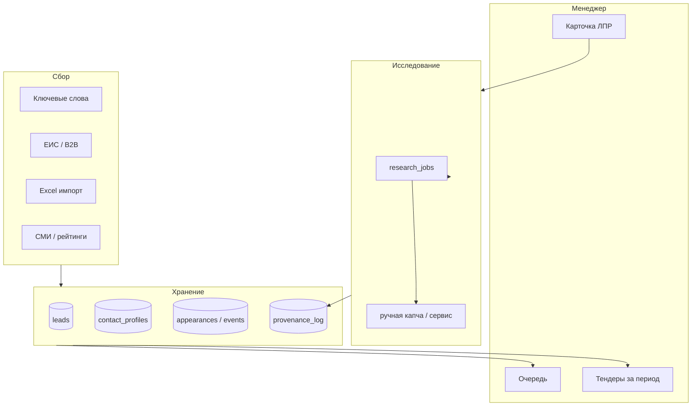

# Product roadmap v2 — инструмент для менеджеров FeedBackTalk

> Черновик для согласования. Не юридическая консультация по 152-ФЗ.

## North Star

Менеджер открывает дашборд и за **15–30 минут** получает очередь действий: **кому** (ЛПР или заказчик), **почему сейчас** (тендер / мероприятие / рейтинг), **что отправить** (питч FeedBackTalk).

## Capability map

| Возможность | Статус | Owner |
|-------------|--------|-------|
| Поиск тендеров ЕИС | ✅ httpx parser | — |
| B2B / Сбербанк | ⚠️ Playwright/LLM | Jules/Cursor |
| Скоринг + питч + воронка | ✅ | Cursor |
| База контактов (СМИ) | ✅ | — |
| Связь тендер ↔ контакт | ✅ suggested/confirmed | — |
| Исследование в сети | ⚠️ капча, 0 результатов | **Jules** |
| Тендеры за период | ❌ | **Cursor** |
| Описание + мероприятия ЛПР | ⚠️ только appearances | **Cursor** |
| Импорт Excel | ❌ | Jules/Cursor |
| Очередь «готов к КП» | ❌ | Cursor |
| 152-ФЗ журнал происхождения | ❌ | **Jules** |
| Ручная капча / resume | ❌ | **Jules** |
| Деплой VPS | ⚠️ SSH ok | Cursor |

## Разделение работы: Cursor vs Jules

| Jules (инфраструктура, автономные PR) | Cursor (продукт, UI, быстрые итерации) |
|---------------------------------------|----------------------------------------|
| zakupki 404, retry, degraded lead | Фильтр тендеров по датам |
| Research jobs + captcha + provenance log | Bio + мероприятия в карточке |
| Excel import backend | Очередь менеджера, вкладки |
| compliance-152fz.md черновик | Деплой systemd/nginx |

Промпты для Jules: `prompts/jules-task-*.md`

## 152-ФЗ (операционные принципы для разработки)

1. **Только открытые источники** — публичные сайты, ЕИС, публикации; без обхода авторизации VK/LinkedIn.
2. **Минимизация** — не хранить лишнее; email/телефон только с provenance (URL + дата).
3. **Цель обработки** — B2B продажи FeedBackTalk (зафиксировать в политике компании).
4. **Ручная верификация** — флаг «канал проверен» перед массовой рассылкой.
5. **Срок хранения** — предложение 24 мес. + удаление по запросу (настроить позже).
6. **Капча** — менеджер решает вручную или платный сервис через env (опционально).

Юрист компании должен утвердить `docs/compliance-152fz.md` (создаёт Jules).

## Архитектура (целевая)

## Профиль ЛПР — структура данных

| Поле | Назначение |
|------|------------|
| `bio` | Свободное описание (кто, фокус, заметки менеджера) |
| `contact_appearances` | Универсальная лента |
| `appearance_type` | `conference` \| `exhibition` \| `talk` \| `interview` \| `rating` \| `article` \| `import_excel` |
| `source_title` | Название мероприятия / доклада |
| `appeared_at` | Дата |
| `snippet` | Тезисы, стенд, роль спикера |
| `meta_json` | `{ "location": "…", "role": "speaker" }` |

## Backlog (кратко)

### P0
- [ ] Jules: zakupki resilience (`prompts/jules-task-zakupki-resilience.md`)
- [ ] Jules: research + captcha + 152-FZ log (`prompts/jules-task-research-captcha-compliance.md`)
- [ ] Cursor: тендеры за период (`prompts/cursor-task-manager-features.md`)
- [ ] Cursor: bio + мероприятия UI

### P1
- [ ] Jules/Cursor: Excel import (`prompts/jules-task-excel-import.md`)
- [ ] Cursor: очередь менеджера «готов к КП»
- [ ] Деплой prod + cron сбора

### P2
- Gosplan API как альтернатива ЕИС
- Yandex Search API (платно) вместо HTML-парсинга

## AGENTS.md для Jules

Рекомендуется добавить в корень репозитория краткий `AGENTS.md` (Jules читает автоматически): стек Python 3.11, FastAPI, SQLAlchemy async, `tender-leads` CLI, не трогать `.env`.

## Следующий шаг

1. Запустить в Jules **три сессии** по файлам `prompts/jules-task-*.md` (можно параллельно на разных ветках).
2. В Cursor — `prompts/cursor-task-manager-features.md`.
3. Созвон: согласовать MVP на 2 недели (только P0).
