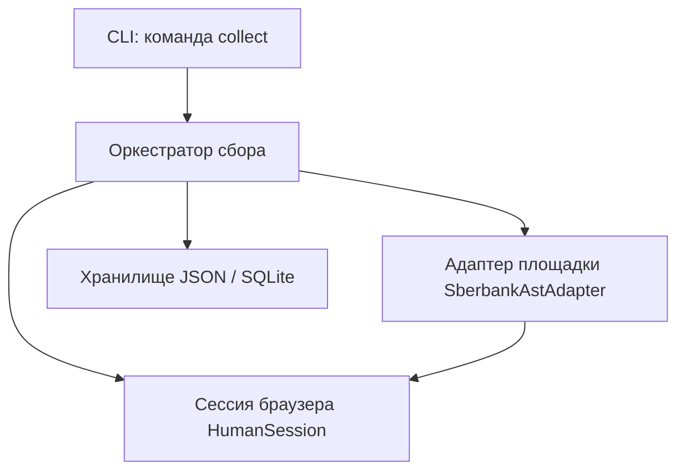

# ТЗ: Задача 1 — автоматический сбор тендеров с площадки

| | |
|--|--|
| Версия | 0.1 |
| Статус | черновик для разработки |
| Интерфейс v1 | **консоль** (`tender-leads`) |
| Пилотная площадка | [Сбербанк-АСТ](https://www.sberbank-ast.ru/) |

---

## 1. История пользователя

**Как** менеджер по продажам  
**я хочу** задать ключевые слова и URL площадки  
**чтобы** система сама прошла по сайту как человек: поиск → фильтры → карточки → пагинация → сбор данных для будущих продаж.

### Пример сценария

1. Менеджер запускает команду с площадкой `https://www.sberbank-ast.ru/` и ключами `опрос сотрудников`, `CRM`.
2. Система открывает сайт, принимает cookie-баннер, находит форму поиска.
3. Вводит ключ, при необходимости выставляет фильтр «период размещения».
4. Обходит страницы выдачи, заходит в каждый релевантный тендер.
5. Сохраняет: название, номер, заказчик, сроки, сумма (если есть), контакты, ссылку.
6. В консоли — прогресс и итог; данные лежат в файле/БД для дальнейшей работы.

---

## 2. Цель и границы

### В scope (задача 1)

- Одна площадка как **эталон**: Сбербанк-АСТ (дальше — тот же контракт для других URL).
- Поведение **как у человека** в браузере: клики, скролл, ожидание загрузки, cookie, пагинация.
- Вход: **URL площадки**, **список ключей**, **базовые фильтры** (минимум — период).
- Выход: **структурированные записи** о тендерах + лог шагов в консоли.

### Вне scope (позже)

- Веб-дашборд, CRM, воронка, email-рассылки.
- Автоматический «разбор любого сайта» без адаптера под площадку.
- Обход жёсткой капчи и логин за закрытые разделы (только фиксация «нужен человек»).
- Параллельный сбор с 10 площадок одновременно.

---

## 3. Что нужно для реализации (компоненты)



| # | Компонент | Назначение |
|---|-----------|------------|
| 1 | **CLI** | Менеджер задаёт URL, ключи, период, лимиты |
| 2 | **Оркестратор** | Цикл: ключ → поиск → страницы → карточки → сохранение |
| 3 | **HumanSession** | Playwright: браузер, cookie, задержки, скриншоты при ошибке |
| 4 | **PlatformAdapter** | Контракт «как искать и парсить» для конкретного сайта |
| 5 | **SberbankAstAdapter** | Реализация под sberbank-ast.ru |
| 6 | **Модель TenderRecord** | Единая структура полей лота |
| 7 | **Store** | Запись результатов, дедуп по URL/номеру |
| 8 | **Логирование** | Понятный вывод: что сейчас делает «робот-менеджер» |

### Стек (решение)

| Технология | Зачем |
|------------|--------|
| **Python 3.11+** | Основной язык |
| **Playwright** | Реальный Chromium, имитация человека, JS-сайты |
| **Typer + Rich** | CLI и читаемый прогресс |
| **SQLite** (шаг 6+) | Локальное хранение; до этого — JSON |
| **pydantic** | Валидация записей тендера |

Почему не «просто httpx»: у торговых площадок часто JS, cookie-гейты, динамическая выдача — без браузера сценарий менеджера не повторить.

---

## 4. Контракт данных

### Вход (параметры команды)

| Параметр | Обязательный | Пример |
|----------|--------------|--------|
| `--platform-url` | да | `https://www.sberbank-ast.ru/` |
| `--keyword` / `-k` | да (≥1) | `опрос`, `CRM` |
| `--date-from` | нет | `2026-05-01` |
| `--date-to` | нет | `2026-06-01` |
| `--max-per-keyword` | нет | `20` (карточек на ключ) |
| `--max-pages` | нет | `5` (страниц выдачи) |
| `--headed` | нет | показать окно браузера (отладка) |
| `-v` | нет | подробный лог |

### Выход (одна запись тендера)

| Поле | Описание |
|------|----------|
| `platform` | нормализованный хост, напр. `sberbank-ast.ru` |
| `external_id` | номер процедуры на площадке |
| `title` | название |
| `url` | ссылка на карточку |
| `customer_name` | заказчик |
| `publish_date` | дата публикации |
| `deadline` | срок подачи / окончания |
| `price` | НМЦ / сумма (если есть) |
| `matched_keyword` | по какому ключу найден |
| `contacts` | телефон, email, ФИО (если на карточке) |
| `raw_snippet` | короткий фрагмент описания |
| `collected_at` | когда собрали |

---

## 5. Поведение «как человек» (HumanSession)

Общие правила для всех площадок:

| Правило | Реализация |
|---------|------------|
| Реалистичный браузер | viewport 1920×1080, русская локаль, обычный User-Agent |
| Cookie / согласия | эвристики: кнопки «Принять», «Согласен», `cookie`, `consent` |
| Паузы | случайная задержка 0.8–2.5 с между действиями |
| Ожидание | `wait_for_load_state`, ожидание селекторов, таймаут с понятной ошибкой |
| Скролл | перед кликом — элемент в зону видимости |
| Пагинация | «Следующая» / номер страницы, стоп по лимиту или концу |
| Ошибки | скриншот в `data/debug/`, сообщение в консоль, продолжить со следующего лота где возможно |
| Сессия | один контекст браузера на весь прогон ключей (cookies сохраняются) |

---

## 6. Контракт адаптера площадки

Каждая площадка — класс с методами:

```text
resolve(url) -> bool          # этот адаптер подходит?
open_home(session)            # главная, cookie
search(session, keyword, filters) -> SearchContext
iter_listing_pages(ctx) -> Iterator[ListingItem]   # url, title, preview
open_detail(session, item) -> TenderRecord
apply_filters(session, period_from, period_to)     # если UI позволяет
```

**SberbankAstAdapter** (пилот): селекторы и URL выдачи выясняются на **шаге 3** через ручной проход + запись шагов (Playwright codegen / trace).

---

## 7. Пошаговый план разработки

Каждый шаг — отдельный инкремент с проверкой. Не переходить дальше, пока не выполнены критерии приёмки.

---

### Шаг 0. Каркас проекта ✅

**Сделано:** пустой пакет, `tender-leads status`.

**Приёмка:** `pip install -e .` и `tender-leads status` работают.

---

### Шаг 1. CLI и контракт команды

**Работы:**

- Команда `tender-leads collect` с параметрами из §4.
- Валидация URL (http/https, хост не пустой).
- Пока без браузера: печать плана («открою X, ключи Y, период Z»).

**Приёмка:**

```bash
tender-leads collect --platform-url https://www.sberbank-ast.ru/ -k "crm" --date-from 2026-05-01 -v
```

выводит осмысленный план и код выхода 0.

---

### Шаг 2. HumanSession (браузер)

**Работы:**

- Зависимость `playwright` в optional `[browser]`.
- Модуль `browser/session.py`: старт Chromium, `goto`, `accept_cookies()`, `human_delay()`.
- Флаг `--headed` для визуальной отладки.
- Сохранение trace/screenshot при падении.

**Приёмка:**

```bash
tender-leads browse --url https://www.sberbank-ast.ru/ --headed
```

браузер открывается, cookie-баннер закрывается (если есть), в логе «готово».

---

### Шаг 3. Разведка Сбербанк-АСТ (адаптер v0)

**Работы:**

- Ручной чеклист: где поиск, какие поля фильтра периода, разметка списка и карточки.
- Документ `docs/platforms/sberbank-ast.md`: URL, селекторы, скриншоты.
- `SberbankAstAdapter.open_home` + `search` — переход на выдачу по одному ключу.
- Без пагинации и карточек — только «вижу N ссылок в выдаче».

**Приёмка:** по одному ключу в консоли `найдено ссылок: N` (N > 0 на тестовом ключе в рабочей сети).

**Риск:** сайт недоступен с сервера разработки — тогда smoke только с машины менеджера или через VPN; в ТЗ зафиксировать.

---

### Шаг 4. Парсинг списка и пагинация

**Работы:**

- `iter_listing_pages`: обход страниц до `--max-pages` или конца.
- Дедуп ссылок в рамках одного ключа.
- Применение фильтра периода в UI (если есть; иначе — фильтр после открытия карточки на шаге 5).

**Приёмка:** для ключа и лимита 2 страницы — список уникальных URL без дублей между страницами.

---

### Шаг 5. Карточка тендера (деталь)

**Работы:**

- `open_detail`: переход в лот, извлечение полей §4.
- Возврат к выдаче или прямой переход по URL следующего лота.
- Лимит `--max-per-keyword` соблюдается.

**Приёмка:** минимум 3 поля заполнены (`title`, `url`, `external_id` или `customer_name`) для 5 карточек подряд.

---

### Шаг 6. Оркестратор и несколько ключей

**Работы:**

- Цикл по ключам в одной сессии браузера.
- Сводка: ключ → найдено → сохранено → пропущено (дубль/ошибка).
- Graceful stop по Ctrl+C с частичным сохранением.

**Приёмка:**

```bash
tender-leads collect --platform-url https://www.sberbank-ast.ru/ \
  -k "crm" -k "опрос" --max-per-keyword 5 -v
```

один прогон, два ключа, итоговая таблица в консоли.

---

### Шаг 7. Сохранение результатов

**Работы:**

- JSON-lines: `data/collect/{date}-{platform}.jsonl` (каждая строка — тендер).
- Дедуп по `(platform, external_id)` или `url`.
- Опционально `--output path.jsonl`.

**Приёмка:** повторный запуск не дублирует те же URL в файле (режим append с проверкой).

---

### Шаг 8. SQLite (когда JSON стабилен)

**Работы:**

- Таблица `tenders`, миграция при старте.
- Команда `tender-leads list --last 20` для просмотра без UI.

**Приёмка:** после collect записи видны в `tender-leads list`.

---

### Шаг 9. Наблюдаемость и эксплуатация

**Работы:**

- Уровни лога: INFO = шаги для менеджера («Ищу: crm, страница 2»).
- `data/debug/` — скриншоты только при ошибках.
- README: установка Playwright, примеры команд, лимиты вежливости (не чаще N запросов/мин).

**Приёмка:** менеджер по логу понимает, на каком шаге остановилось, без чтения кода.

---

## 8. Структура каталогов (целевая)

```text
src/tender_agents/
  cli.py                 # collect, browse, list
  models.py              # TenderRecord, CollectFilters
  collect/
    orchestrator.py      # цикл ключ × страницы × карточки
    store.py             # jsonl / sqlite
  browser/
    session.py           # HumanSession
    cookies.py           # accept consent
  platforms/
    base.py              # PlatformAdapter ABC
    registry.py          # url -> adapter
    sberbank_ast.py      # пилот
docs/
  task-01-spec.md        # это ТЗ
  platforms/
    sberbank-ast.md      # селекторы после разведки
data/
  collect/               # результаты
  debug/                 # скриншоты ошибок
```

---

## 9. Риски и ограничения

| Риск | Митигация |
|------|-----------|
| Сайт меняет вёрстку | Адаптер изолирован; версия селекторов в `sberbank-ast.md` |
| Таймаут / блокировка IP | Задержки, один поток, не nightly без согласования |
| Капча / логин | Сообщение «нужен ручной ввод», скриншот, стоп |
| Юридические ограничения | Только публичные данные; robots/ToS — не DDoS, разумные лимиты |
| Нет фильтра периода в UI | Фильтровать по `publish_date` после открытия карточки |

---

## 10. Критерии готовности задачи 1 (Definition of Done)

- [ ] Менеджер одной командой задаёт URL Сбербанк-АСТ и 1+ ключей.
- [ ] Система в браузере: cookie → поиск → фильтры (где есть) → пагинация → карточки.
- [ ] Результат в `data/collect/*.jsonl` (и/или SQLite) без дублей.
- [ ] В консоли виден пошаговый прогресс на русском.
- [ ] Документированы команды установки и запуска в README.
- [ ] Известные сбои (капча, недоступность) описаны, не падают «молча».

---

## 11. Следующий шаг после задачи 1

- Второй адаптер (например zakupki.gov.ru) по тому же контракту `PlatformAdapter`.
- Минимальный просмотрщик результатов (не «настройки», а «последний сбор»).

---

## 12. Команды для README (целевые)

```bash
pip install -e ".[browser]"
playwright install chromium

tender-leads collect \
  --platform-url https://www.sberbank-ast.ru/ \
  -k "опрос сотрудников" \
  -k "CRM" \
  --date-from 2026-05-01 \
  --max-per-keyword 10 \
  --max-pages 3 \
  -v
```
