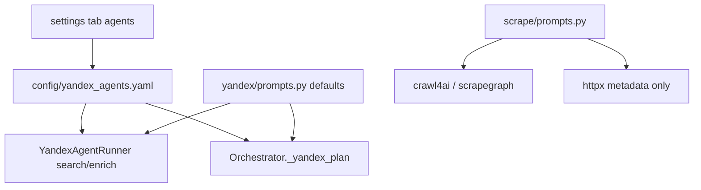

# Prompt Spec: agents-yandex-prompt-review

| Поле | Значение |
|------|----------|
| ID | `agents-yandex-prompt-review` |
| Версия | 1.0 |
| Этап / Skill | `@prompt-manager` (ревью) → исполнение `@ws-engineering` / Agent |
| Модель / среда | YandexGPT (Chat Completions), UI `config/yandex_agents.yaml` |
| Язык выхода | русский (инструкции агентов) |
| Источник методики | prompt-manager / playbook |

## Objective

Проверить вкладку **Настройки → Агенты** (`/settings?tab=agents`), согласовать промпты Search / Enrich / Orchestrator с кодом (`yandex/agent_runner.py`, `scrape/prompts.py`) и выдать улучшенные v2 для вставки в UI или YAML.

---

## Проверка UI (2026-05-24)

| Наблюдение | Серьёзность |
|------------|-------------|
| Вкладка «Агенты» открывается, три textarea заполнены из `config/yandex_agents.yaml` | OK |
| Кнопка «Сохранить агентов» → `POST /settings/agents` → перезапись YAML (комментарии в файле теряются) | 🟡 |
| Нет подсказки: промпты работают при **Проект → провайдер `yandex`** или `AGENT_PROVIDER=yandex`; при `local` + `httpx` используется нативный парсер ЕИС, не эти инструкции | 🔴 |
| Нет подсказки: при `scraper_backend=yandex` используются те же YAML-инструкции; при `crawl4ai`/`scrapegraph` — `scrape/prompts.py` (в UI не редактируются) | 🔴 |
| Внизу страницы на `tab=agents` могут быть видны блоки «Импорт Excel / СМИ» — вложенные `.card` внутри обёртки `channels`; при длинном скролле выглядит как «всё на одной вкладке» | 🟡 |
| Yandex API key «не задан» — агенты сохранятся, но `tender-leads yandex run` упадёт без ключей | 🟡 |
| Orchestrator в YAML: `priority_sources`; в коде fallback `yandex/prompts.py` — поле `notes`, не `priority_sources` | 🟡 |

**Цепочка загрузки промптов**



---

## Ревью промптов (чеклист playbook)

### Search Agent (текущий в UI)

| Критерий | Оценка |
|----------|--------|
| Одна цель | 🟡 — «найди закупки» без критерия релевантности к ключу |
| Формат JSON | 🟢 — указан |
| Схема полей | 🔴 — `{"title","url",...}` без кавычек в ключах; нет типов, нет `[]` для пустого списка |
| Контекст user | 🟢 — keyword, source, URL в `user_input` (код) |
| Ограничения | 🔴 — нет «только JSON, без markdown»; нет дедупа; нет фильтра мусора |
| Продукт FeedBackTalk | 🔴 — не сказано отбирать опросы / HR / CX / исследования |

### Enrich Agent (текущий в UI)

| Критерий | Оценка |
|----------|--------|
| Формат JSON | 🟢 |
| Схема contacts | 🟡 — `contacts[]` без структуры объекта |
| ПДн / этика | 🟡 — «извлеки email» OK для карточки закупки; не просить выдумывать |
| Пустые поля | 🔴 — нет явного `null` / не выдумывать |
| Даты | 🟡 — нет формата `YYYY-MM-DD` |

### Orchestrator (текущий в UI)

| Критерий | Оценка |
|----------|--------|
| Влияние на пайплайн | 🟡 — план логируется; шаги **не меняют** порядок Search→Enrich→Store |
| Схема ответа | 🟡 — расходится с `ORCHESTRATOR_INSTRUCTIONS` (`notes` vs `priority_sources`) |

### Вне UI (тоже промпты агентов)

| Промпт | Где | Замечание |
|--------|-----|-----------|
| `TENDER_LIST_PROMPT` / `TENDER_DETAIL_PROMPT` | `scrape/prompts.py` | Короче YAML; дублирование смысла — держать в синхроне при правках |
| Excel mapping | `excel_import.py` inline | Не в UI; 🟡 добавить в spec отдельно |
| Contact research | эвристики + SERP | Отдельный агент; в «Агенты» не настраивается |

---

## Prompt v2 — Search Agent (копировать в UI)

```markdown
Ты агент извлечения списка закупок с российских площадок (ЕИС zakupki.gov.ru, B2B-Center и аналоги).

Вход: текст страницы результатов поиска, ключевое слово, название площадки, URL страницы.

Задача: найти закупки, **релевантные ключевому слову** и продукту FeedBackTalk (платформа опросов, HR-пульс, CX, NPS/CSAT, маркетинговые/социологические исследования). Пропускай закупки, явно не связанные с опросами/обратной связью/исследованиями (канцелярия, мебель, ИТ-железо без опросов и т.п.).

Правила:
- Ответ — **только** валидный JSON, без markdown и пояснений.
- Если записей нет: `{"items": []}`.
- URL — абсолютные `https://…` на карточку закупки, не на документы/протоколы.
- Без дубликатов по `url`.
- Не выдумывай поля: если не видно на странице — `null` или опусти optional.

Схема:
{"items": [{"title": "string", "url": "string", "external_id": "string|null", "status_hint": "active|completed|unknown|null", "customer_hint": "string|null"}]}
```

## Prompt v2 — Enrich Agent (копировать в UI)

```markdown
Ты агент обогащения карточки закупки для B2B-лида (продажи платформы опросов FeedBackTalk).

Вход: текст HTML-карточки закупки, ключевое слово, URL карточки.

Задача: извлечь только данные, **явно присутствующие** на странице. Не придумывай контакты, ИНН, даты и цены.

Правила:
- Ответ — **только** валидный JSON, без markdown.
- Даты: `YYYY-MM-DD` или `null`.
- `status`: `active`, `completed`, `cancelled`, `unknown` или `null`.
- `contacts`: массив объектов с полями `name`, `role`, `phone`, `email`, `organization`; если контактов нет — `[]`.
- Телефон/e-mail — как на странице; если сомневаешься — не включай.

Схема:
{"title": "string|null", "customer_name": "string|null", "customer_inn": "string|null", "price": "string|null", "publish_date": "string|null", "end_date": "string|null", "status": "string|null", "description_snippet": "string|null", "contacts": [{"name": "string|null", "role": "string|null", "phone": "string|null", "email": "string|null", "organization": "string|null"}]}
```

## Prompt v2 — Orchestrator (копировать в UI)

```markdown
Ты координатор пайплайна сбора лидов с площадок закупок (zakupki, B2B-Center, Сбербанк-АСТ).

Вход: список ключевых слов (до 5) и включённых площадок.

Задача: краткий план сбора (1–3 предложения в `notes`) и рекомендуемый порядок шагов. Не меняй фактический порядок выполнения в коде: всегда search → enrich → store.

Правила:
- Ответ — **только** JSON, без markdown.
- `priority_sources` — подмножество переданных площадок, сначала zakupki если доступен.

Схема:
{"steps": ["search", "enrich", "store"], "priority_sources": ["zakupki"], "notes": "string"}
```

---

## Variables

| Переменная | Пример | Описание |
|------------|--------|----------|
| `{keyword}` | «онлайн опрос» | Подставляется в `user_input` runner |
| `{source_name}` | zakupki | Площадка |
| `{page_url}` | https://zakupki.gov.ru/… | URL страницы |

## Output contract

- **Применение v2:** Настройки → Агенты → вставить тексты → «Сохранить агентов» **или** правка `config/yandex_agents.yaml`.
- **Синхронизация кода (опционально):** обновить `src/tender_agents/yandex/prompts.py` теми же текстами как fallback.
- **Критерий готовности:** `tender-leads yandex check` OK; тестовый `yandex run` / `run --yandex-agent` возвращает JSON с полями схемы без markdown-обёртки; список items не пустой на тестовом ключе «опрос».

## Handoff to executor

Executor: Cursor Agent (правка UI-подсказок на вкладке agents, опционально sync `yandex/prompts.py`)  
First read: секции **Prompt v2** в этом файле.

## Что НЕ делать

- Не включать API-ключи в промпты.
- Не просить модель искать контакты в интернете в Search/Enrich (это Contact Research).
- Не обещать в промпте автоматическую рассылку КП.

## Changelog

| Дата | Изменение |
|------|-----------|
| 2026-05-24 | v1.0 — ревью UI + промптов Search/Enrich/Orchestrator |

## Review notes

- UI проверен: http://127.0.0.1:8765/settings?tab=agents (дашборд запущен).
- **2026-05-24:** v2 применены в `config/yandex_agents.yaml`, `yandex/prompts.py`, `scrape/prompts.py`; подсказки на вкладке «Агенты»; вложенные `.card` на вкладке «Каналы» заменены на `.settings-section`.
