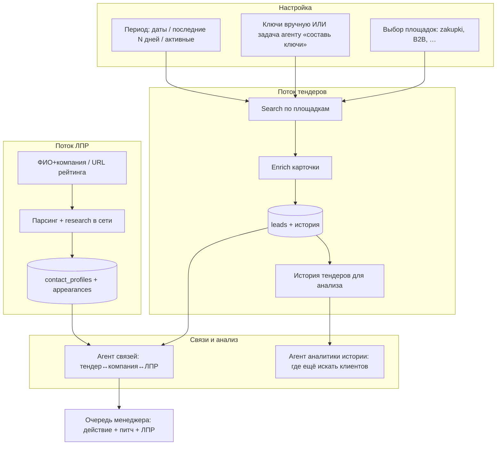

# Prompt Spec: platform-procurement-lpr-osminog

| Поле | Значение |
|------|----------|
| ID | `platform-procurement-lpr-osminog` |
| Версия | 1.0 |
| Этап / Skill | `@prompt-manager` → исполнение Agent / OpenClaw (осминог) |
| Модель / среда | Cursor Agent, cron, OpenClaw skill `skills/tender-leads/` |
| Язык выхода | русский |
| Продукт | FeedBackTalk · репозиторий `tender-lead-agents` |
| Связанные spec | `prompts/product-review-sales-managers.md`, `prompts/agents-yandex-prompt-review.md` |

## Objective

Зафиксировать целевой **сквозной процесс** платформы: менеджер задаёт площадки и период поиска (или поручает агенту ключи) → сбор тендеров в таблицу → история для аналитического агента → раздел ЛПР (ФИО/компания/URL рейтинга) → обогащение и связи «тендер ↔ компания ↔ должностное лицо»; для новых площадок — шаблон адаптера без ручного кода «с нуля» где возможно.

---

## North Star (процесс менеджера)



---

## As-Is в репозитории (привязка к коду)

| Требование | Сейчас | Пробел |
|------------|--------|--------|
| Выбор площадок | `config/sources.yaml` + UI «Площадки» | Нет мастера «добавить площадку»; новая площадка = код в `ADAPTER_CLASSES` |
| Ключи вручную | `keywords.yaml`, UI «Ключи» | Нет агента «составь ключи из задачи» в UI |
| Период поиска | Фильтры `date_from` / `period` на очереди (частично в `app.py`) | **Нет** периода в самом `SearchAgent` / API площадок (сбор «всё что в выдаче») |
| Парсинг zakupki | `parsers/zakupki.py` + адаптер | OK |
| Парсинг B2B/Сбер | Нативные парсеры + Playwright/Yandex | Нестабильно без сети/JS |
| Новая площадка «агентом» | Нет | Нужен **Source Adapter Generator** (LLM + шаблон) |
| Таблица тендеров | SQLite `leads`, дашборд `/` | OK |
| История тендеров | Данные в БД, нет отдельного «аналитического» агента/UI | Нужен export + **History Analyst Agent** |
| ЛПР: URL рейтинга | `channels/kommersant.py`, ingest URL | OK для известных шаблонов |
| ЛПР: ФИО+компания | Ручной ввод / Excel import | Research agent есть |
| Обогащение ЛПР | `contact_research_agent`, `profile_enrich_agent` | Капча, без единого ТЗ в UI |
| Связи тендер↔ЛПР | `tender_contact_links` + confirm в UI | Эвристика; нет агента «предложи и обоснуй» |
| Оркестрация вне IDE | `scripts/daily-cron.sh`, OpenClaw skill | Расширить под новые job-типы |

---

## To-Be: роли агентов

| Агент | Вход | Выход | Где в коде (целевое) |
|-------|------|-------|----------------------|
| **Keyword Planner** | Текст задачи менеджера («опросы HR, госсектор») | `keywords.yaml` + обоснование | новый `agents/keyword_planner_agent.py` |
| **Source Scout** | URL площадки, пример поиска | Спека адаптера: search URL, селекторы, JSON schema | новый `agents/source_scout_agent.py` + PR |
| **Tender Collector** | площадки, ключи, **date_from–date_to** | `leads` | расширить `Orchestrator` + адаптеры |
| **Tender History Analyst** | выгрузка `leads` за период | Отчёт: сегменты, заказчики, формулировки, рекомендации ключей/площадок | новый `agents/tender_analyst_agent.py` |
| **LPR Ingest** | URL таблицы / ФИО+org | `contact_profiles` | `channels/*` + расширяемый registry |
| **LPR Research** | contact_id | appearances, каналы, соцсети | `contact_research_agent` (есть) |
| **Link Resolver** | lead_id, contact_id, org names | `tender_contact_links` + confidence + evidence | новый `agents/link_resolver_agent.py` |
| **Sales Queue** | всё выше | Очередь «готов к контакту» | UI (`docs/product-review` P0) |

---

## Prompt (готово к копированию) — Keyword Planner

```markdown
## Role
Ты — агент планирования ключевых слов для поиска закупок FeedBackTalk (платформа опросов, HR-пульс, CX, исследования).

## Context
Продукт: опросы, eNPS, VOC, NPS/CSAT, платформа обратной связи, маркетинговые/социологические исследования.
Сегменты в CRM: hr, cx, research, gov.

## Input
- `{task}` — свободная формулировка менеджера (русский).
- `{existing_keywords}` — текущий список из keywords.yaml (не дублировать).
- `{merge_hr_cx}` — true/false: добавить ли блоки из keywords_hr.yaml / keywords_cx.yaml.

## Task
1. Извлеки 8–20 поисковых фраз для zakupki.gov.ru и B2B-площадок.
2. Исключи: CRM, 1С, канцелярия, мебель, чистый ИТ без опросов.
3. Для каждой фразы — тег сегмента (hr|cx|research|gov|other).

## Output
Только JSON:
{
  "keywords": ["фраза 1", "..."],
  "segment_hints": {"фраза 1": "hr"},
  "notes": "1–3 предложения для менеджера"
}

## Do not
- Не предлагать массовый спам или закрытые базы контактов.
```

---

## Prompt (готово к копированию) — Source Scout (новая площадка)

```markdown
## Role
Ты — инженер интеграции площадок закупок. Цель: описать, как искать и парсить карточки на новой площадке.

## Input
- `{platform_name}` — название.
- `{base_url}` — корень сайта.
- `{search_example_url}` — пример URL поиска с подставленным ключом «онлайн опрос».
- `{html_sample}` — фрагмент HTML страницы результатов (если есть) ИЛИ описание вёрстки от оператора.

## Task
Верни JSON-спеку для разработчика Python (адаптер SourceAdapter):
{
  "source_id": "snake_case",
  "search": {
    "method": "GET|POST",
    "url_template": "…{keyword}…",
    "requires_js": true|false,
    "pagination": "query|path|none"
  },
  "list_selectors": {
    "item": "css",
    "title": "css",
    "url": "css attr href",
    "customer_hint": "css|null"
  },
  "detail": {
    "fields": ["title","customer_name","customer_inn","end_date","contacts"],
    "notes": "…"
  },
  "risks": ["капча", "rate limit"],
  "recommended_backend": "httpx|playwright|yandex"
}

## Constraints
- Только публичные страницы, соблюдение robots/задержек.
- Если данных в HTML нет — указать requires_js: true, не выдумывать поля.
```

---

## Prompt (готово к копированию) — Tender History Analyst

```markdown
## Role
Ты — аналитик воронки госзакупок для продаж FeedBackTalk.

## Input
CSV/JSON выгрузка тендеров за период: title, customer_name, segment, score, source, matched_keyword, end_date, pipeline_status.

## Task
1. Топ-10 заказчиков и повторяемость тем.
2. Какие ключевые слова дали лучший precision (мало мусора).
3. Какие площадки/сегменты недоиспользованы.
4. 5–10 **новых** ключевых фраз для следующего сбора.
5. Рекомендации: на каких площадках расширить поиск.

## Output
Markdown-отчёт ≤ 2 страницы: разделы «Находки», «Рекомендации», «Риски».
Таблицы допустимы. Без выдуманных ФИО и контактов.
```

---

## Prompt (готово к копированию) — Link Resolver

```markdown
## Role
Ты связываешь закупку (тендер) с должностным лицом из базы ЛПР.

## Input
- Тендер: customer_name, title, url, segment.
- Кандидаты ЛПР: [{full_name, organization, position, appearances_summary}].

## Task
Для каждого кандидата: confidence 0–100, method (org_match|name_in_text|manual), evidence (1 предложение).
Статус: suggested | rejected — только suggested если confidence ≥ 60.

## Output
JSON: {"links": [{"contact_profile_id": N, "confidence": 80, "evidence": "…"}]}
Не предлагать автоматическую отправку КП.
```

---

## Roadmap (фазы)

| Фаза | Срок | Результат |
|------|------|-----------|
| **F1 — Управляемый сбор** | 3–4 нед | Период в UI+пайплайне; Keyword Planner в «Запуск»; стабильный zakupki |
| **F2 — Площадки** | 4–6 нед | Реестр площадок + Source Scout → PR адаптера; 1 новая B2B площадка |
| **F3 — История и аналитика** | 3–4 нед | Выгрузка истории; Tender History Analyst (кнопка + отчёт) |
| **F4 — ЛПР end-to-end** | 4–5 нед | Единая форма: ФИО / URL; research; sanitize; карточка сделки |
| **F5 — Связи агентом** | 2–3 нед | Link Resolver batch + UI подтверждения |

---

## Backlog (issue-style) + Osminog

| ID | Задача | P | Effort | DoD | Исполнитель |
|----|--------|---|--------|-----|-------------|
| OSM-01 | UI: период сбора `date_from` / `date_to` + передача в Orchestrator/адаптеры zakupki | P0 | L | Сбор за 7/30 дней не тянет архив без лимита | Agent |
| OSM-02 | Агент Keyword Planner + кнопка «Сгенерировать ключи из задачи» | P0 | M | JSON → preview → запись keywords.yaml | Agent |
| OSM-03 | Экспорт «История тендеров» CSV + страница «Аналитика истории» | P1 | M | Кнопка + файл + prompt Tender History Analyst | Agent |
| OSM-04 | Registry `channels/` — регистрация парсеров по домену (не только kommersant) | P1 | M | Новый URL рейтинга по доке SKILL | Agent |
| OSM-05 | Source Scout: CLI `tender-leads source scout --url` → JSON spec | P1 | L | Spec в `config/sources.d/` | Agent |
| OSM-06 | Генерация черновика адаптера из spec (полуавтомат) | P2 | L | PR + тест fixture HTML | Agent |
| OSM-07 | Link Resolver agent + cron пересчёт suggested links | P1 | M | ≥30% confirm без правки | Agent |
| OSM-08 | Unified «карточка сделки» (тендер+ЛПР+связи) | P1 | L | Один URL из очереди | Agent |
| OSM-09 | OpenClaw: уведомление «сбор завершён + топ-3 + ссылка на анализ истории» | P2 | S | skill обновлён | **Осминог** |
| OSM-10 | Job queue table: keyword_plan, tender_run, lpr_research, link_resolve | P2 | L | Статусы в UI | Agent + Osminog |

### Handoff Osminog (OpenClaw / cron)

```markdown
После `scripts/daily-cron.sh` или ручного «Запуск»:
1. Прочитать `data/leads.db` / экспорт CSV за последние 24h.
2. Если новых горячих (score≥60) > 0 — сообщение менеджеру:
   «Собрано N тендеров, M горячих. Топ: [заказчик — предмет — дедлайн]. Дашборд: http://127.0.0.1:8765/?min_score=60»
3. Если включён флаг ANALYST=1 — вызвать Tender History Analyst на weekly CSV.
4. Не отправлять персональные данные вне корпоративного канала.
```

Файл skill: `skills/tender-leads/SKILL.md` — расширить секцией «Расписание и уведомления».

---

## Variables

| Переменная | Пример |
|------------|--------|
| `{task}` | «Найти закупки на пульс-опросы в госсекторе за квартал» |
| `{platform_name}` | «РТС-тендер» |
| `{date_from}` | `2026-01-01` |
| `{date_to}` | `2026-03-31` |

---

## Output contract

- Этот файл: `prompts/platform-procurement-lpr-osminog.md`
- Продуктовое дополнение (по запросу): `docs/platform-process-osminog.md` — краткая версия для менеджеров
- Критерий готово F1: менеджер в UI задаёт площадки, период, ключи (или генерирует агентом) → в таблице только релевантные тендеры за период

---

## Handoff to executor

**Следующий шаг для разработки (Cursor Agent):**  
1. Прочитать секции **OSM-01, OSM-02** и реализовать в `web/app.py`, `orchestrator.py`, `sources/zakupki.py`.  
2. Не начинать «универсальный парсер всего» — сначала период + keyword planner.

**Осминог:** обновить `skills/tender-leads/SKILL.md` и `scripts/daily-cron.sh` по блоку Handoff Osminog.

---

## Что НЕ делать в v1

- Автопарсинг LinkedIn/email без согласия и верификации.
- Обещание «любая площадка без кода» — только spec + полуавтогенерация адаптера.
- Массовый архив ЕИС без лимитов и задержек.

---

## Changelog

| Дата | Изменение |
|------|-----------|
| 2026-05-24 | v1.0 — процесс по запросу пользователя + промпты агентов + backlog Osminog |

## Review notes (prompt-manager)

- 🔴 Критично: период должен фильтровать **на этапе поиска**, не только в UI-списке БД.
- 🟡 Source Scout не заменяет юридическую проверку правил площадки.
- 🟢 История тендеров — сильный дифференциатор для второго агента; привязать к OSM-03 рано в F1/F2.
