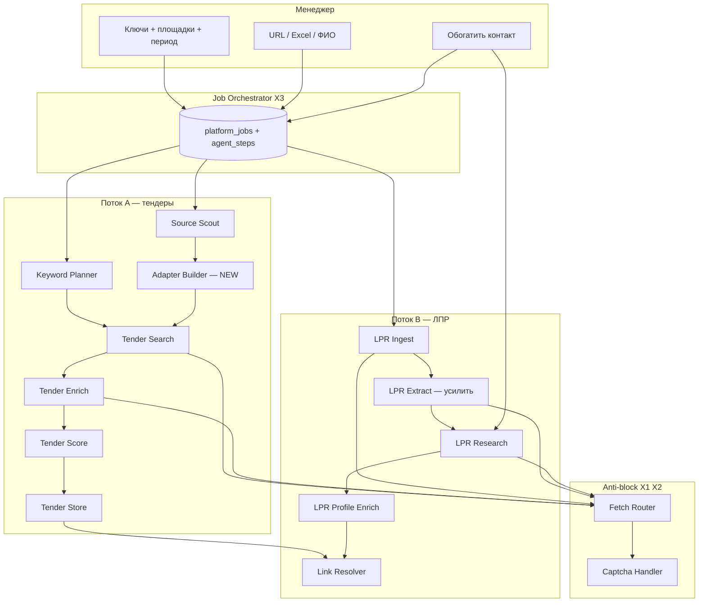

# Prompt Spec: vision-ai-collection-platform

| Поле | Значение |
|------|----------|
| ID | `vision-ai-collection-platform` |
| Версия | 1.0 |
| Этап / Skill | `@prompt-manager` → исполнение Agent / ChatGPT / Cursor |
| Модель / среда | Cursor Agent, cron, OpenClaw |
| Язык выхода | русский |
| Продукт | FeedBackTalk · репозиторий `tender-lead-agents` |
| Заменяет устаревший фокус | `prompts/product-review-sales-managers.md` (CRM-дашборд) — **не отменяет код**, меняет North Star |
| Связанные spec | `prompts/platform-procurement-lpr-osminog.md`, `docs/product-review-sales-managers.md` |

## Objective

Зафиксировать **истинную задачу** продукта: **AI-first платформа автоматического сбора данных** для менеджеров — тендеры по ключам с множества площадок + ЛПР по ссылкам с обогащением через поиск в сети. Архитектура: **мелкие задачи → отдельный агент на задачу → оркестратор jobs**. Пересмотреть As-Is, выдать план, backlog и контракты между агентами. UI — панель **задач и логов агентов**, не полноценная CRM.

---

## North Star (истинная цель)

Менеджер **запускает сбор**, а не «копается в настройках»:

1. **Тендеры:** ключевые слова × площадки × период → система находит лоты, раскрывает карточки, извлекает описание, заказчика, сроки, **контакты с площадки**. **Новая площадка:** менеджер даёт URL → ИИ **разведывает** сайт → (целевое) **генерирует/подключает адаптер** → smoke-test сбора.

2. **ЛПР:** менеджер даёт **ссылки** (рейтинг, статья, каталог) или **ФИО + должность + компания** → ИИ **извлекает людей** → по запросу **обогащение:** поиск → обход ссылок из выдачи → контакты и упоминания в карточку.

3. **Блокировки:** капча, rate limit, «смог» в SERP — **отдельный контур** (Fetch Router + Captcha Handler + очередь ручного дозапроса), не разрозненные ошибки в UI.

**Не цель v1:** воронка продаж, Kanban, «дашборд за 15 минут» как главный UX, массовый холодный email без верификации.

**Ошибка прежней постановки:** продукт строился как **sales cockpit** (очередь, питч, воронка, справка). Ключевая боль — **неудобный сбор и слабая роль ИИ в интеграции площадок и обогащении**.

---

## As-Is: почему текущая платформа не решает задачу

| Ожидание | Сейчас в коде | Пробел |
|----------|---------------|--------|
| Добавил площадку → ИИ собирает | `source_scout_agent` → JSON-спека; адаптер = **ручной код** `sources/*`, `ADAPTER_CLASSES` | Нет **Adapter Builder Agent** и smoke-test job |
| Сбор по ключам × N площадок × период | `Orchestrator` + `SearchAgent` (zakupki в основном); период частично | B2B/АСТ нестабильны; UX = вкладки **Настройки**, не **одна job** |
| Любая ссылка → ФИО/должность | `channels/kommersant`, Excel, точечный LLM | Нет **универсального LPR Extract Agent** |
| Обогащение: SERP → crawl → контакты | `contact_research_agent`, `profile_enrich_agent` | Нет единого job **Research → Captcha → Retry** |
| Видно, что делает система | Много экранов: тендеры, воронка, аналитика, 8 вкладок settings | Нет **лога шагов агентов** как главного интерфейса |

### Что уже можно переиспользовать

| Компонент | Путь | Роль в To-Be |
|-----------|------|----------------|
| Tender Search | `agents/search_agent.py` | T4 |
| Tender Enrich | `agents/enrich_agent.py` | T5 |
| Tender Store | `agents/store_agent.py` | T7 |
| Orchestrator | `agents/orchestrator.py` | X4 (цепочка T4→T5→T7) |
| Keyword Planner | `agents/keyword_planner_agent.py` | T1 |
| Source Scout | `agents/source_scout_agent.py` | T2 |
| Contact Research | `agents/contact_research_agent.py` | L3 |
| Profile Enrich | `agents/profile_enrich_agent.py` | L4 |
| Link Resolver | `agents/link_resolver_agent.py` | L5 |
| Tender Analyst | `agents/tender_analyst_agent.py` | T8 |
| Jobs (частично) | `platform_jobs`, UI «Задачи» | X3 |
| Fetch backends | `scrape/factory`, httpx/playwright/yandex | X1 |
| Парсер ЕИС | `scrape/parsers/zakupki.py` | T4/T5 для zakupki |

---

## To-Be: алгоритм (сквозной процесс)



**Правила оркестрации:**

1. Каждый шаг — **один агент**, вход/выход только **JSON** (см. контракты ниже).
2. При `blocked|captcha` шаг переходит в `waiting_human` или **retry** с другим backend (X1).
3. UI показывает: **Job → список шагов → статус → артефакт** (файл, таблица, счётчик записей).

---

## Матрица агентов

### Поток A — тендеры

| ID | Агент | Вход | Выход | Код сейчас |
|----|-------|------|-------|------------|
| T1 | **Keyword Planner** | `{task, existing_keywords?, merge_hr_cx?}` | `{keywords[], segment_hints, notes}` | есть |
| T2 | **Source Scout** | `{url, html_sample?}` | adapter spec JSON | есть |
| T3 | **Adapter Builder** | spec T2 | `{source_id, adapter_path\|yaml, smoke_test_ok}` | **нет** |
| T4 | **Tender Search** | `{sources[], keywords[], date_from, date_to}` | `{items[]: url, title, external_id}` | есть |
| T5 | **Tender Enrich** | `{url, source_id}` | `{fields, contacts[], description}` | есть |
| T6 | **Tender Score** | enriched lot | `{lead, score, segment, pitch}` | scoring + pitches |
| T7 | **Tender Store** | scored leads | `{saved, duplicates}` | есть |
| T8 | **Tender History Analyst** | CSV/period | `{report_md, keyword_suggestions[]}` | есть |

### Поток B — ЛПР

| ID | Агент | Вход | Выход | Код сейчас |
|----|-------|------|-------|------------|
| L1 | **LPR Ingest** | `{urls[]\|file}` | `{pages[]\|rows[]}` | channels, excel_ingest |
| L2 | **LPR Extract** | `{html\|url}` | `{people[]: name, title, org}` | частично; **универсализировать** |
| L3 | **LPR Research** | `{contact_id\|name, org, title}` | `{appearances[], channels[], serp_log}` | есть |
| L4 | **LPR Profile Enrich** | `{contact_id}` | `{email?, phone?, linkedin?}` | есть |
| L5 | **Link Resolver** | `{lead_id?, contact_id?, org_names}` | `{links[], confidence, evidence}` | есть + DB эвристика |

### Инфраструктура

| ID | Слой | Назначение | Код сейчас |
|----|------|------------|------------|
| X1 | **Fetch Router** | httpx → playwright → yandex API по риску | factory |
| X2 | **Captcha Handler** | detect → rotate engine → pause → manual queue | разрозненно |
| X3 | **Job Orchestrator** | типы job, state machine, agent_steps | platform_jobs |
| X4 | **Tender Pipeline Orchestrator** | T1? → T4→T5→T6→T7 | orchestrator.py |

---

## Типы Job (контракт оркестратора)

| `job_type` | Цепочка агентов | Параметры менеджера |
|------------|-----------------|---------------------|
| `tender_collect` | T1? → T4 → T5 → T6 → T7 | sources, keywords, date_from, date_to, max_per_keyword |
| `source_onboard` | T2 → T3 → T4 (smoke) | platform_url, sample_search_url |
| `keyword_plan` | T1 | manager_task, save_to_yaml? |
| `lpr_ingest` | L1 → L2 | urls[] или file |
| `lpr_research` | L3 → (L4?) | contact_id |
| `lpr_enrich_light` | L4 | contact_id |
| `link_resolve` | L5 | scope: all\|lead_id |
| `tender_history_analyze` | T8 | period |

### Статусы шага агента

`pending` → `running` → `ok` | `failed` | `blocked` → (`retrying` | `waiting_human`) → `ok` | `failed`

---

## JSON между агентами (минимальный контракт)

```json
{
  "job_id": 42,
  "step": "T5_enrich",
  "agent": "TenderEnrich",
  "input": { "url": "https://...", "source_id": "zakupki" },
  "output": {
    "title": "...",
    "customer_name": "...",
    "end_date": "2026-06-01",
    "contacts": [{ "name": "", "email": "", "phone": "" }],
    "description": "..."
  },
  "fetch": { "backend": "httpx", "status_code": 200, "blocked": false }
}
```

При `blocked: true` обязательны: `block_reason`, `challenge_url?`, `recommended_backend`.

---

## Anti-block: стратегия (X1 + X2)

| Уровень | Действие |
|---------|----------|
| 1 | Детект: маркеры captcha в HTML, HTTP 403/429, пустая SERP |
| 2 | Retry: смена backend (httpx → playwright → Yandex Search API если настроен) |
| 3 | Throttle: `request_delay_sec`, лимит страниц за job |
| 4 | Queue: job step `waiting_human` + UI `/research/jobs` (расширить на все типы fetch) |
| 5 | Fallback: сохранить snippet/SERP в артефакт job, не падать всем пайплайном |

**Не делать:** обход ToS/капчи «в обход закона»; только публичные страницы, задержки, ручная верификация менеджером.

---

## Roadmap (6 недель, 1 разработчик)

| Фаза | Срок | Результат |
|------|------|-----------|
| **F0** | нед 1 | Утвержить spec, job types, deprecate-list UI; `docs/vision-ai-collection-platform.md` |
| **F1** | нед 1–2 | UI «Новая задача»: `tender_collect` + лог шагов; период в T4 на всех enabled sources |
| **F2** | нед 2–3 | T2+T3: onboard площадки (spec → черновик адаптера → smoke test) |
| **F3** | нед 3–4 | L2 универсальный extract; `lpr_ingest` job |
| **F4** | нед 4–5 | X2 единый Captcha Handler; `lpr_research` как один job с retry |
| **F5** | нед 5–6 | L5 + минимальный результат UI (таблицы + restart step); T8 опционально |

---

## Backlog (issue-style)

| ID | Задача | P | Effort | Агент | Критерий готово |
|----|--------|---|--------|-------|-----------------|
| VAP-01 | Job UI: форма `tender_collect` + таблица `agent_steps` | P0 | M | X3 | Менеджер видит прогресс T4/T5/T7 |
| VAP-02 | Период `date_from`/`date_to` в SearchAgent для всех адаптеров | P0 | M | T4 | В БД только лоты за период |
| VAP-03 | Adapter Builder: spec → YAML/код + регистрация в `sources.d` | P0 | L | T3 | Новый домен: smoke 3 лота |
| VAP-04 | `source_onboard` job в orchestrator | P0 | M | T2,T3,X3 | Одна кнопка в UI |
| VAP-05 | LPR Extract Agent (LLM + table parser) | P0 | L | L2 | Произвольный URL рейтинга → ≥1 person |
| VAP-06 | `lpr_ingest` + `lpr_research` jobs | P0 | M | L1,L3,X3 | Обогащение из карточки = job, не fire-and-forget |
| VAP-07 | Captcha Handler: единый модуль + статусы | P0 | M | X2 | blocked → waiting_human → retry |
| VAP-08 | Fetch Router: policy по `risk` из spec T2 | P1 | M | X1 | scout spec задаёт backend |
| VAP-09 | Deprecate primary nav: воронка/аналитика → secondary | P1 | S | UI | Главный вход = Jobs |
| VAP-10 | Link Resolver в cron + evidence в UI | P1 | M | L5 | suggested + rationale text |
| VAP-11 | Tender History Analyst кнопка из job | P2 | S | T8 | CSV + markdown отчёт |
| VAP-12 | OpenClaw: уведомление «job завершён» | P2 | S | Osminog | skill обновлён |

---

## Prompt (готово к копированию) — ChatGPT / планирование

```markdown
## Role
Ты — архитектор multi-agent системы сбора данных (тендеры + ЛПР), Python/FastAPI/SQLite.

## My real goal
Managers run automated collection:
1) Tenders: keywords × multiple procurement platforms; AI helps add new platforms and extract lot details + contacts.
2) Contacts: ingest by URLs; AI extracts people; enrichment = web search → follow SERP links → extract contacts/mentions.
Handle captcha/blocks via dedicated anti-bot layer (fetch router + captcha handler).

## Architecture
One agent per small task; Job Orchestrator chains steps; UI = jobs + agent step log + result tables (NOT a full CRM).

## Existing code (reuse)
SearchAgent, EnrichAgent, StoreAgent, Orchestrator, contact_research_agent, profile_enrich_agent,
source_scout_agent, keyword_planner_agent, link_resolver_agent, tender_analyst_agent, platform_jobs.

## Current problem
Dashboard is CRM-oriented (pipeline, analytics, many settings tabs) and does NOT solve AI-first collection and platform onboarding.

## Read in repo
prompts/vision-ai-collection-platform.md (this spec), src/tender_agents/agents/, web/app.py, scrape/, sources/

## Task
1) Refine agent matrix T1–T8, L1–L5, X1–X4 and job types.
2) Job state machine + JSON contracts between agents.
3) Anti-bot strategy detail.
4) 6-week plan for one developer.
5) Minimal UI wireframe (jobs-first).
6) List what to deprecate in current dashboard.

## Output
Russian, tables + mermaid, backlog VAP-01… with acceptance criteria.
Do not propose rewrite on another stack. No secrets from .env.
```

---

## Prompt (готово к копированию) — Adapter Builder (T3)

```markdown
## Role
Ты — инженер интеграции. По JSON-спеке Source Scout сгенерируй конфиг адаптера для tender-lead-agents.

## Input
- `{adapter_spec}` — JSON от Source Scout (source_id, search_url, list_selectors, detail fields, risk, recommended_backend).

## Task
1. Сгенерируй YAML в `config/sources.d/{source_id}.yaml` ИЛИ черновик Python-класса, наследующего SourceAdapter.
2. Укажи тестовые fixture-пути и команду smoke: `tender-leads run -s {source_id} -k "тест" --max-per-keyword 3`.
3. Если `requires_js` — явно playwright; если `captcha` — не обещать httpx-only.

## Output
Только JSON:
{
  "files": [{"path": "...", "content_preview": "..."}],
  "registration_note": "как включить в build_adapters",
  "smoke_test_command": "...",
  "blockers": []
}
```

---

## Prompt (готово к копированию) — LPR Extract (L2)

```markdown
## Role
Ты извлекаешь контактных лиц из публичной HTML-страницы (рейтинг, статья, список спикеров).

## Input
- `{url}` — источник.
- `{html}` — фрагмент страницы (если есть).

## Task
Верни JSON:
{
  "people": [
    {"full_name": "...", "title": "...", "organization": "...", "source_quote": "фрагмент строки"}
  ],
  "page_type": "rating_table|article|directory|unknown",
  "confidence": 0.0-1.0
}

## Rules
- Только явно названные люди; не выдумывать email/телефон.
- Если таблица — все строки с ФИО; дубликаты по ФИО+org слить.

## Do not
- Парсить закрытые соцсети без публичного HTML.
```

---

## Что НЕ делать в v1

- Строить продукт вокруг воронки/Kanban как главного экрана.
- Обещать «любая площадка без кода» — только spec + полуавтомат T3 + smoke test.
- Массовый outreach по email из автопарсинга.
- Игнорировать captcha — без X2 job'ы будут «молча падать».

## Что отложить / упростить в UI

| Экран | Действие |
|-------|----------|
| `/pipeline`, `/analytics` | Secondary / скрыть из главного nav |
| `/help` FAQ менеджера | Оставить, переписать под jobs (после F1) |
| 8 вкладок `/settings` | Свернуть в «Параметры по умолчанию для jobs» |
| `/queue` sales | Заменить на «Результаты jobs» + фильтр hot |

---

## Variables

| Переменная | Пример | Описание |
|------------|--------|----------|
| `{repo}` | `/Users/evgenii/Desktop/agents` | Корень |
| `{task}` | «Опросы HR госсектор Q2» | Для T1 |
| `{platform_url}` | `https://…` | Для T2/T3 |
| `{date_from}` | `2026-01-01` | Для T4 |
| `{date_to}` | `2026-03-31` | Для T4 |

---

## Output contract

| Артефакт | Путь | Когда |
|----------|------|-------|
| Этот spec | `prompts/vision-ai-collection-platform.md` | сейчас |
| Краткая версия для команды | `docs/vision-ai-collection-platform.md` | executor F0 |
| Реализация | код + миграции `agent_steps` при необходимости | F1+ |

**Критерий готово F1:** менеджер создаёт job `tender_collect`, видит шаги T4→T5→T7 и новые строки в `leads` без захода в 8 вкладок настроек.

---

## Handoff to executor

**Cursor Agent (следующий спринт):**

1. Прочитать этот файл целиком.
2. Реализовать **VAP-01, VAP-02** (jobs UI + период в search).
3. Не расширять воронку/аналитику до закрытия VAP-01.

**ChatGPT:** скопировать секцию «Prompt — ChatGPT / планирование» для детализации контрактов и оценок.

**Осминог:** после VAP-12 — уведомления по завершению `tender_collect`, не по «горячим в воронке».

---

## Changelog

| Дата | Изменение |
|------|-----------|
| 2026-05-24 | v1.0 — истинная задача AI collection platform; матрица агентов; backlog VAP; anti-block; deprecate CRM-first UX |

## Review notes (prompt-manager)

- 🔴 **North Star сменился** — `product-review-sales-managers` остаётся справочником по экранам, но не главный драйвер разработки.
- 🔴 **T3 Adapter Builder** — критический gap между Scout и реальным сбором.
- 🟡 UI: jobs-first обязателен до новых фич воронки.
- 🟢 Агенты L3/L4/T4/T5 уже в коде — не переписывать с нуля, обернуть в X3.
